[github](https://github.com/ShravanDDeotale) &nbsp;·&nbsp;
[discord](https://discord.gg/lovedate) &nbsp;·&nbsp;
[youtube](https://youtube.com/@shravanddeotale) &nbsp;·&nbsp;
[instagram](https://www.instagram.com/shravanddeotale)

> Student developer. B.Tech Computer Science & Engineering student. 
> I enjoy building software, experimenting with new technologies, and turning ideas into real projects.

I build web applications, Discord projects, developer tools, and experimental 
projects while learning and exploring different areas of software development.

<samp>javascript &nbsp; typescript &nbsp; python &nbsp; discord.js &nbsp; node.js &nbsp; electron &nbsp; git &nbsp; html &nbsp; css</samp>

**[Self__bot](https://github.com/ShravanDDeotale/Self__bot)** &nbsp;·&nbsp; <samp>javascript · electron</samp> 
A powerful Discord selfbot control unit and web dashboard featuring Lavalink v4 
audio streaming, multi-token management, and automated captcha solving.

**[Discord_token_humanizer](https://github.com/ShravanDDeotale/Discord_token_humanizer)** &nbsp;·&nbsp; <samp>python</samp> 
A standalone Discord profile customizer and humanizer featuring stealth WebSocket 
emulation, automated profile styling, and proxy rotation.

**[COLLAB-CODING-AND-CHATING-APP](https://github.com/ShravanDDeotale/COLLAB-CODING-AND-CHATING-APP)** &nbsp;·&nbsp; <samp>javascript</samp> 
A collaborative coding and chatting application for working and 
communicating together in one place.

**[Smart-YT-Analyzer](https://github.com/ShravanDDeotale/Smart-YT-Analyzer)** &nbsp;·&nbsp; <samp>python</samp> 
A Python-based YouTube analysis project for exploring video and channel 
data with a developer-focused workflow.

**[Fizyy-Music](https://github.com/ShravanDDeotale/Fizyy-Music)** &nbsp;·&nbsp; <samp>typescript</samp> 
A TypeScript music bot focused on building a modern, high-fidelity 
audio streaming experience.

**[Love-Music](https://github.com/ShravanDDeotale/Love-Music)** &nbsp;·&nbsp; <samp>javascript</samp> 
A multi-guild sharded JavaScript music bot from my open-source work.

**[Token-Gen-DC](https://github.com/ShravanDDeotale/Token-Gen-DC)** &nbsp;·&nbsp; <samp>python</samp> 
A Python Discord automation project from my collection of experiments and tools.

No third-party stats widgets. The graphics on this page are generated by 
the repository's own Python script using the GitHub GraphQL API and GitHub Actions.

The workflow refreshes the graphics automatically and commits only when 
the generated files actually change.

<samp>built by ShravanDDeotale</samp>

